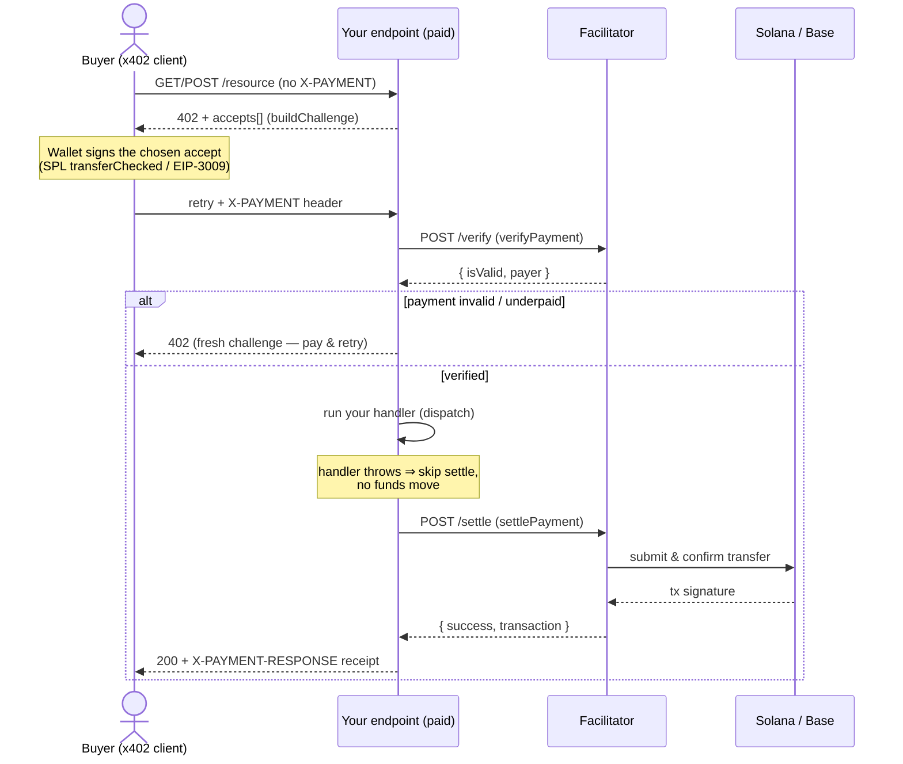

<h1 align="center">@three-ws/x402-server</h1>

<p align="center"><strong>The seller side of <a href="https://x402.org">x402</a> — turn any HTTP endpoint into a paid one in a few lines.</strong></p>

<p align="center">Build the <code>402</code> challenge · verify the payment · run the work · settle on-chain · return the receipt.</p>

<p align="center">
  <a href="https://www.npmjs.com/package/@three-ws/x402-server"></a>
  <a href="https://www.npmjs.com/package/@three-ws/x402-server"></a>
  <a href="./LICENSE"></a>
  <a href="https://nodejs.org"></a>
  
</p>

<p align="center">
  <a href="#install">Install</a> ·
  <a href="#quickstart">Quickstart</a> ·
  <a href="#how-x402-settlement-works">How it works</a> ·
  <a href="#api-reference">API</a> ·
  <a href="#configuration-reference">Config</a> ·
  <a href="#networks--assets">Networks &amp; assets</a> ·
  <a href="#pairing-with-a-buyer">Pairing</a> ·
  <a href="#error-handling">Errors</a> ·
  <a href="#faq--troubleshooting">FAQ</a>
</p>

---

`@three-ws/x402-server` is the **seller** half of x402: the middleware and
primitives that make an HTTP endpoint demand payment. Wrap a route with
[`paid()`](#paidoptions-handler--reqresnext--void) and it answers an unpaid
request with a `402 Payment Required` challenge — listing what it `accepts`
(asset · amount · network · pay-to) — then, on the retry that carries an
`X-PAYMENT` header, it **verifies** the payment, **dispatches** your handler,
**settles** on-chain, and returns the result with an `X-PAYMENT-RESPONSE`
receipt.

It speaks two lanes from one config: **Solana** (facilitator-settled SPL
`transferChecked`) and **EVM / Base** (gasless
[EIP-3009](https://eips.ethereum.org/EIPS/eip-3009)
`transferWithAuthorization`). It never signs or pays — pair it with any x402
buyer-side client such as [`@three-ws/x402-fetch`](#pairing-with-a-buyer); they
pay, this charges.

## Why

x402 revives HTTP `402 Payment Required` as a real payment rail: a server
answers a request with a `402` whose body lists its `accepts[]`, the client
pays, and re-sends the request with an `X-PAYMENT` header. The buyer side is a
solved problem — drop in a fetch wrapper and it pays. **The seller side is where
everyone reinvents the same machinery:** build the challenge envelope in the
exact v2 shape, advertise the right asset and fee-payer per chain, parse the
`X-PAYMENT` header, call a facilitator's `/verify`, run the work *only after*
verification, settle *only after* the work succeeds, emit the receipt, and
(optionally) skim a fee out of the price without double-charging the buyer.

This package is that machinery, done once.

- **One wrapper, a paid route.** `paid({ price, asset, payTo })` emits the 402
  and gates your handler behind a verified payment.
- **Two lanes, one API.** Solana and Base/EVM accepts come from the same config;
  the challenge advertises both and the buyer picks.
- **Settle after the work, never before.** Verification gates the handler;
  settlement runs only after it returns. A failed call moves no funds, so a
  retry can't double-charge.
- **Optional fee without surprise-billing.** A fee is split *out* of the listed
  price — the buyer's total is never marked up, and the fee ships inert (rate
  `0`, no recipient) until you turn it on.
- **USDC by default, `$THREE` optional.** USDC is the default settlement asset;
  an optional `$THREE` Solana SPL token can be advertised alongside it.
- **Zero dependencies.** Pure JS + the platform `fetch`. Runs on Node 18+, Bun,
  Deno, and Cloudflare Workers. Ships TypeScript types.

## Install

```bash
npm install @three-ws/x402-server
```

Node 18+ (uses the global `fetch`). Zero runtime dependencies. Framework-agnostic:
works as Express/Connect middleware, a bare `(req, res)` handler on Vercel or
Node `http`, and a fetch-style `(request) => Response` handler via the
[`fetchAdapter`](#fetchadapter).

## Quickstart

A paid USDC endpoint in under 60 seconds. Two things to know first:

1. **`price` is in atomic units** of the asset. USDC has 6 decimals, so
   `'10000'` = `$0.01` and `'1000000'` = `$1.00`.
2. **Point the SDK at your facilitator** — the service that runs `/verify` and
   `/settle`. Set it once via an env var (or the `facilitator` option per route):

   ```bash
   export X402_FACILITATOR_URL="https://your-facilitator.example.com"
   ```

Now wrap a handler. Unpaid requests get a `402`; paid ones run the handler:

```js
// server.mjs — node server.mjs, then POST to http://localhost:3000/summarize
import express from 'express';
import { paid } from '@three-ws/x402-server';

const app = express();
app.use(express.json());

app.post('/summarize', paid(
  {
    price: '10000',                       // $0.01 USDC (6-decimal atomics)
    asset: 'usdc',                        // the default — USDC
    payTo: { base: '0xYourPayoutAddress' },
    network: ['base'],
  },
  async (req, res, payment) => {
    // Runs only after a verified payment. `payment` is the verified payer.
    const summary = `Summary of: ${String(req.body?.text ?? '').slice(0, 80)}`;
    res.json({ summary, billedTo: payment.payer });
  },
));

app.listen(3000, () => console.log('paid endpoint on :3000'));
```

The first unpaid request returns the `402` challenge. A buyer-side x402 client
pays it and re-sends with an `X-PAYMENT` header; your handler runs once,
settlement lands, and the response carries the on-chain receipt in
`X-PAYMENT-RESPONSE`. That's the whole loop.

> Prefer a raw handler with no framework? See
> [the raw verify → settle example](./docs/examples.md#3-raw-node-http-handler-no-framework).

## How x402 settlement works

The order is always **verify → dispatch → settle**. Work runs only after a valid
payment; funds move only after the work succeeds. A handler that throws never
charges; a facilitator outage never silently rejects a good payment.



On **Solana** the accept advertises a `feePayer` (the facilitator's sponsor
account); the buyer's wallet signs an SPL `transferChecked` of the named mint to
`payTo`, the facilitator co-signs as fee payer and lands it — the buyer pays no
SOL gas. On **Base / EVM** the buyer signs an EIP-3009
`transferWithAuthorization` typed-data message locally (no on-chain tx, no gas)
and the facilitator submits it.

`paid()` wraps four primitives — [`buildChallenge`](#buildchallengeoptions--challenge),
[`verifyPayment`](#verifypaymentargs-expected--promiseverifyresult),
[`settlePayment`](#settlepaymentargs--promisereceipt), and
[`feeSplit`](#feesplitpriceatomics-bps-recipient--feesplit--null) — that you can
drive directly when you don't want the middleware. See
[the raw flow example](./docs/examples.md#3-raw-node-http-handler-no-framework).

## API reference

Every export is documented exhaustively in **[docs/api.md](./docs/api.md)**. The
summary below covers the full public surface.

| Export | Kind | What it does |
|---|---|---|
| [`paid`](#paidoptions-handler--reqresnext--void) | function | Wrap a handler so it requires payment (Express / Vercel / fetch). |
| [`buildChallenge`](#buildchallengeoptions--challenge) | function | Build the v2 `402` envelope (no facilitator needed). |
| [`verifyPayment`](#verifypaymentargs-expected--promiseverifyresult) | function | Verify an `X-PAYMENT` header against your `accepts[]`. |
| [`settlePayment`](#settlepaymentargs--promisereceipt) | function | Settle a verified payment on-chain, return the receipt. |
| [`feeSplit`](#feesplitpriceatomics-bps-recipient--feesplit--null) | function | Carve an optional platform fee *out* of the price. |
| [`createX402Server`](#createx402serveroptions--client) | function | Bind a facilitator / fetch / auth to a reusable client. |
| [`fetchAdapter`](#fetchadapter) | object | Adapter for `(request) => Response` runtimes. |
| [`X402Error`](#x402error) | class | Base typed error (`code`, `status`, `detail`, `retryAfter`, `body`). |
| [`PaymentRequiredError`](#paymentrequirederror) | class | `X402Error` subclass for HTTP `402` (adds `accepts`). |
| `X402_VERSION` | const | `2` — the x402 wire format version this speaks. |
| `MAX_FEE_BPS` | const | `1000` — the hard 10% ceiling on `feeBps`. |
| `DEFAULT_FACILITATOR_URL` / `DEFAULT_BASE_URL` | const | `''` — no baked-in host; you supply one. |
| `NETWORK_SOLANA_MAINNET` | const | `solana:5eykt4UsFv8P8NJdTREpY1vzqKqZKvdp` |
| `NETWORK_BASE_MAINNET` | const | `eip155:8453` |
| `NETWORK_BASE_SEPOLIA` | const | `eip155:84532` |

---

### `paid(options, handler) → (req, res, next?) => void`

Wrap a request handler so it requires payment. Returns a standard
`(req, res, next?)` function — mount it as Express/Connect middleware, a Vercel
function, or a Node `http` handler. Pass [`adapter: fetchAdapter`](#fetchadapter)
to get a `(request) => Response` handler instead.

Unpaid requests get a `402` challenge. Paid ones run **verify → dispatch →
settle**: a verified payment gates the handler, the handler runs, then
settlement lands and the receipt is attached.

**Options** — see the [full configuration reference](#configuration-reference)
for types, defaults, and env vars. Required: `price` and `payTo` (and `feePayer`
when advertising the Solana lane). Everything else is optional.

**Handler** — `(req, res, payment) => unknown` (or `(request, payment) => Response`
with `fetchAdapter`). `payment` is present only on a paid call:
`{ payer, network, amount, accept }`. **Throwing from the handler returns its
error to the buyer and skips settlement — no funds move.**

**Throws** — `X402Error` (`code: 'invalid_input'`) at construction time if
`handler` isn't a function, or if `feeBps > 0` without `feeTo`. At request time,
a facilitator outage surfaces as an `X402Error` with `status: 502`
(`facilitator_unreachable` on `/verify`, `settle_uncertain` on `/settle`).

```js
import { paid } from '@three-ws/x402-server';

export default paid(
  { price: '10000', asset: 'usdc', payTo: { base: '0xYourPayoutAddress' }, network: ['base'] },
  async (req, res) => res.json({ ok: true }),
);
```

### `buildChallenge(options) → Challenge`

Build the v2 `402` envelope. Returns
`{ x402Version: 2, error, resource, accepts, extensions, fee? }` — the same
object you base64 into the `PAYMENT-REQUIRED` response header. **Needs no
facilitator.** Accepts the ergonomic `{ price, asset, payTo, … }` shape or a
pre-built `accepts[]` (which overrides `price`/`asset`/`payTo`).

When `feeBps > 0` and `feeTo` are set, the envelope also carries a `fee`
([`FeeSplit`](#feesplitpriceatomics-bps-recipient--feesplit--null)).

**Returns** — a `Challenge`:

```ts
{
  x402Version: 2,
  error: string,                 // human reason, default "X-PAYMENT header is required"
  resource: { url, mimeType, description?, serviceName?, tags?, iconUrl? },
  accepts: Accept[],             // one entry per lane; Solana leads
  extensions: Record<string, unknown>,
  fee?: FeeSplit | null,         // present only when feeBps > 0 && feeTo
}
```

Each `Accept`:

```ts
{ scheme: 'exact', network, amount, asset, payTo, maxTimeoutSeconds,
  resource?, extra: { name, decimals, version?, feePayer? } }
//                                                ^ feePayer required on Solana
```

**Throws** — `X402Error` (`code: 'invalid_input'`) when `price` is missing or
not a whole atomic string, when `payTo` is missing or names an unknown lane, or
when `asset: 'three'` is used on a non-Solana lane. A Solana accept without a
`feePayer` throws `code: 'missing_fee_payer'`.

### `verifyPayment(args, expected?) → Promise<VerifyResult>`

Decode the base64 `X-PAYMENT` header and verify it against your `accepts[]` via
the facilitator's `/verify`. Two call shapes are accepted:

```js
verifyPayment({ paymentHeader, requirements, signal? });   // object form
verifyPayment(xPaymentHeaderString, expected);             // positional form
```

`requirements` / `expected` may be an `accepts[]` array, a full `Challenge`, a
`{ requirements }` / `{ accepts }` wrapper, or a single `Accept`.

**Returns** — a `VerifyResult`:

- On success: `{ ok: true, payer, network, amount, accept, paymentPayload, requirement, raw }`.
- On a rejected / under-paid / wrong-network payment: `{ ok: false, code, status,
  reason, body }`, where `body` is a fresh `402` envelope you can return directly
  to re-challenge the buyer. **This is not a throw** — handle it as a 402.

**Call your handler only when `ok`.**

**Throws** — does **not** throw on a bad payment (returns `ok: false`). It *does*
throw an `X402Error` with `status: 502` when the facilitator is unreachable or
returns `5xx` (`code: 'facilitator_unreachable'`) — no funds moved, safe to
retry — and `code: 'invalid_input'` if you pass empty `requirements`.

### `settlePayment(args) → Promise<Receipt>`

Settle a verified payment on-chain via the facilitator's `/settle`. Pass the
object returned by `verifyPayment` (either `{ verified }` or the verified object
directly). **Run this only after the work succeeds.**

**Returns** — a `Receipt`: `{ network, payer, transaction, raw }`. base64 it into
the `X-PAYMENT-RESPONSE` header.

**Throws** — `X402Error`:
- `code: 'invalid_input'` if not given a verified object.
- `code: 'settle_failed'` (`status: 502`) when the facilitator reports
  `success !== true`.
- `code: 'settle_uncertain'` (`status: 502`) when `/settle` is unreachable —
  verified and the work ran, but settlement status is unknown; **check on-chain
  before retrying** to avoid double-paying.
- `code: 'facilitator_bad_response'` (`status: 502`) if the facilitator's
  claimed network or payer doesn't match what was verified (defense-in-depth).

### `feeSplit(priceAtomics, bps, recipient) → FeeSplit | null`

Split a platform fee **out** of the listed price:
`fee = floor(price × bps / 10_000)`, `net = price − fee`. The buyer's total is
never marked up. Returns `null` when no fee applies (rate `0`, no recipient, or a
sub-atomic fee) so the creator keeps the whole price. `bps` is clamped to
`[0, 1000]` (`MAX_FEE_BPS`, 10%).

```js
import { feeSplit } from '@three-ws/x402-server';

feeSplit('1000000', 250, 'YourFeeRecipient');
// → { price: '1000000', net: '975000', fee: '25000', bps: 250, recipient: 'YourFeeRecipient' }
feeSplit('1000000', 0, 'x');   // → null  (rate 0)
feeSplit('3', 250, 'x');       // → null  (sub-atomic fee floors to 0)
```

Never throws — bad input returns `null`.

### `createX402Server(options) → client`

Bind a facilitator URL, `fetch`, and optional auth headers into a reusable
client — handy to share a facilitator override or custom `fetch` across many
routes. Returns `{ buildChallenge, verifyPayment, settlePayment, paid }`.

```js
import { createX402Server } from '@three-ws/x402-server';

const server = createX402Server({
  facilitator: 'https://your-facilitator.example.com',
  apiKey: process.env.FACILITATOR_API_KEY,   // → Authorization: Bearer …
});

export default server.paid({ price: '10000', payTo: { base: '0xYou' }, network: ['base'] }, handler);
```

**Throws** — `X402Error` (`code: 'no_fetch'`) if no `fetch` is available and none
is passed.

### `fetchAdapter`

An adapter that lets `paid()` serve Web `Request` / `Response` runtimes
(Cloudflare Workers, Deno, Bun, edge functions). Pass it as `adapter` in the
`paid()` options; your handler then receives `(request, payment)` and returns a
`Response` (or a plain object, which is JSON-encoded). The challenge and receipt
headers are attached to the `Response` automatically.

```js
import { paid, fetchAdapter } from '@three-ws/x402-server';

export default {
  fetch: paid(
    { price: '10000', payTo: { base: '0xYou' }, network: ['base'], adapter: fetchAdapter },
    async (request, payment) => Response.json({ ok: true, billedTo: payment.payer }),
  ),
};
```

### `X402Error`

Base error for the SDK. Extends `Error`.

| Property | Type | Description |
|---|---|---|
| `name` | `string` | `'X402Error'`. |
| `message` | `string` | Human-readable reason. |
| `code` | `string` | Stable machine code, e.g. `invalid_input`, `invalid_payment`, `settle_failed`, `facilitator_unreachable`, `settle_uncertain`. |
| `status` | `number \| null` | The HTTP status to surface (e.g. `402`, `400`, `502`), or `null`. |
| `detail` | `string` (optional) | Extra context from the facilitator, when present. |
| `retryAfter` | `number` (optional) | Seconds to wait before retrying, parsed from a `Retry-After` header / `retry_after` body field. |
| `body` | `unknown` | The raw facilitator response body (or a fresh 402 body), when present. |

See the [error code table](#error-handling) for the full list and the HTTP
status each maps to.

### `PaymentRequiredError`

A subclass of [`X402Error`](#x402error) thrown on HTTP `402`. It defaults
`code` to `'payment_required'` and `status` to `402`, and adds:

| Property | Type | Description |
|---|---|---|
| `accepts` | `unknown \| null` | The challenge `accepts[]` from the `402` body, when present — read it to pay manually, or hand it to a payment-aware `fetch`. |

This is raised by the internal facilitator HTTP client when *it* receives a
`402`; on the seller side you primarily produce 402s (via `verifyPayment`'s
`{ ok: false, body }` and `paid()`), rather than catch them.

## Configuration reference

Every option accepted by [`paid()`](#paidoptions-handler--reqresnext--void) and
[`buildChallenge()`](#buildchallengeoptions--challenge), plus the environment
variables the SDK reads.

### `paid()` / `buildChallenge()` options

| Option | Type | Default | Description |
|---|---|---|---|
| `price` | `string \| number` | — (**required**) | Amount in **atomic units** of the asset. `'10000'` = `$0.01` of 6-decimal USDC. Must be a whole number. |
| `asset` | `'usdc' \| 'three' \| { solana?, base? }` | `'usdc'` | Settlement asset. `'usdc'` resolves the canonical USDC mint/contract per lane; `'three'` resolves the optional `$THREE` SPL token (**Solana-only**); an object pins explicit addresses. |
| `payTo` | `{ solana?, base?, 'base-sepolia'? }` | — (**required**) | Pay-to address per lane. At least one lane is required. |
| `network` | `Lane \| Lane[]` | every lane in `payTo` | Which lanes to advertise (`'solana'`, `'base'`, `'base-sepolia'`). Solana leads when present. |
| `feePayer` | `string` | — | The Solana facilitator sponsor account. **Required whenever a Solana accept is advertised** (else `missing_fee_payer`). |
| `acceptThree` | `boolean` | `false` | Advertise the optional `$THREE` SPL token alongside USDC on the Solana lane (a second accept, after USDC). USDC stays the default. |
| `threeAmount` | `string \| number` | `price` | Atomic `$THREE` amount (6 decimals) for the `acceptThree` entry. Omit to reuse `price`. |
| `feeBps` | `number` | `0` | Platform fee in basis points, **split out of `price`** (clamped to `MAX_FEE_BPS` = `1000` / 10%). `0` = no fee. |
| `feeTo` | `string` | — | Fee recipient. **Required when `feeBps > 0`** — no recipient, no fee. |
| `facilitator` | `string` | `X402_FACILITATOR_URL` env, else `''` | Override the facilitator base URL for `/verify` + `/settle`. (`buildChallenge` only) alias `baseUrl` on `createX402Server`. |
| `maxTimeoutSeconds` | `number` | `60` | How long the buyer has to land the signed payment for an accept. |
| `resourceUrl` | `string` | request URL (under `paid()`) | The canonical resource URL echoed into the challenge `resource`. |
| `description` | `string` | — | Human label for the resource (shown in wallets). |
| `mimeType` | `string` | `'application/json'` | MIME type advertised on the resource. |
| `serviceName` | `string` | — | Discovery metadata (truncated to 32 chars). |
| `tags` | `string[]` | — | Discovery tags (max 5). |
| `iconUrl` | `string` | — | Icon URL echoed into the challenge. |
| `error` | `string` | `'X-PAYMENT header is required'` | The human reason on the `402` envelope. |
| `accepts` | `Accept[]` | — | Pre-built accepts (raw path). Overrides `price`/`asset`/`payTo`. |
| `extensions` | `Record<string,unknown>` | `{}` | Extra fields merged into the challenge `extensions`. |
| `onSettled` | `(receipt) => void` | — | (`paid()` only) Fired after a successful settlement — record the call, fire a webhook. A throw here is swallowed so it can't unsettle a paid call. |
| `adapter` | `PaidAdapter` | node `(req,res)` | (`paid()` only) Pass [`fetchAdapter`](#fetchadapter) for a `(request) => Response` runtime. |

### `createX402Server()` options

| Option | Type | Default | Description |
|---|---|---|---|
| `facilitator` | `string` | `X402_FACILITATOR_URL` env, else `''` | Facilitator base URL for `/verify` + `/settle`. |
| `baseUrl` | `string` | — | Alias for `facilitator` (resolved the same way). |
| `fetch` | `typeof fetch` | `globalThis.fetch` | `fetch` implementation. Pass one on a runtime without a global `fetch`. |
| `apiKey` | `string` | — | Bearer token attached as `Authorization: Bearer …` on every facilitator call. |
| `headers` | `Record<string,string>` | — | Default headers attached to every facilitator call. |

### Environment variables

| Variable | Read by | Description |
|---|---|---|
| `X402_FACILITATOR_URL` | `verifyPayment`, `settlePayment`, `paid()`, `createX402Server` | The facilitator origin for `/verify` + `/settle`, used when no explicit `facilitator`/`baseUrl` option is given. **Resolution order:** explicit option → `X402_FACILITATOR_URL` → `''` (empty). `buildChallenge` and `feeSplit` never read it. |

> Convention: keep your Solana facilitator sponsor account in an env var (e.g.
> `X402_FEE_PAYER_SOLANA`) and pass it as `feePayer`. The SDK doesn't read that
> var itself — you wire it into the option — but the error message points to it
> by name when a Solana accept omits `feePayer`.

## Networks & assets

USDC is the default settlement asset on every lane and needs zero extra config.

| Lane | Network id | Default asset | Scheme | Buyer signs | Gas |
|---|---|---|---|---|---|
| **Solana** | `solana:5eykt4UsFv8P8NJdTREpY1vzqKqZKvdp` | USDC (`EPjFWdd5AufqSSqeM2qN1xzybapC8G4wEGGkZwyTDt1v`) | `exact` | SPL `transferChecked` (facilitator co-signs) | facilitator pays |
| **Base** | `eip155:8453` | USDC (`0x833589fCD6eDb6E08f4c7C32D4f71b54bdA02913`) | `exact` (EIP-3009) | `transferWithAuthorization` typed data | facilitator pays |
| **Base Sepolia** | `eip155:84532` | USDC (Base mint) | `exact` (EIP-3009) | same | facilitator pays |

Solana leads the `accepts[]` so first-accept clients settle there; advertise
`network: ['base']` (or both) to lead with EVM. The same envelope is also base64
into the `PAYMENT-REQUIRED` response header so a discovery crawler can read it
off the header during a probe request.

To pin a non-canonical token address, pass `asset: { solana: '…', base: '0x…' }`.

> **Base USDC EIP-712 domain:** the Base accept advertises `extra.name = "USD
> Coin"` (not `"USDC"`) — that's the on-chain EIP-712 domain name; using `"USDC"`
> recomputes the wrong domain hash and the facilitator rejects the signature. The
> SDK sets this for you.

### Optional `$THREE` token (opt-in — USDC is the default)

`$THREE` is an **optional** Solana SPL settlement token (mint
`FeMbDoX7R1Psc4GEcvJdsbNbZA3bfztcyDCatJVJpump`, 6 decimals). It is **Solana-only**
and **off by default** — USDC remains the default everywhere. Two ways to use it:

**Advertise it alongside USDC** — set `acceptThree: true`. The challenge lists
two Solana accepts (USDC first, then `$THREE`), so a wallet's token chooser
surfaces both while a first-accept client still settles USDC:

```js
import { paid } from '@three-ws/x402-server';

export default paid(
  {
    price: '50000',                 // USDC amount (atomic)
    payTo: { solana: 'YourSolanaPayToAddress' },
    feePayer: 'YourFacilitatorFeePayer',
    acceptThree: true,              // adds a second Solana accept for $THREE
    threeAmount: '50000',           // optional; defaults to `price`
  },
  async (req, res) => res.json({ ok: true }),
);
```

**Make `$THREE` the only asset** — set `asset: 'three'` (Solana only;
advertising it on an EVM lane throws `invalid_input`):

```js
buildChallenge({
  price: '10000000',          // 10 $THREE (6-decimal atomics)
  asset: 'three',
  payTo: { solana: 'YourSolanaPayToAddress' },
  feePayer: 'YourFacilitatorFeePayer',
});
```

Omit both options and the route is USDC-only.

## Pairing with a buyer

This package only *charges*. To *pay* one of its endpoints, use any x402
buyer-side client — for example [`@three-ws/x402-fetch`](https://www.npmjs.com/package/@three-ws/x402-fetch),
the seller's natural counterpart. It wraps `fetch`: on a `402` it reads the
`accepts[]`, signs and pays the chosen lane, and re-sends with the `X-PAYMENT`
header — transparently, so the call looks free to your code.

```js
// Buyer side (in a separate app / agent)
import { wrapFetch } from '@three-ws/x402-fetch';

// `signer` is a wallet that can sign the SPL / EIP-3009 payment.
const pay = wrapFetch(fetch, { signer });

const res = await pay('https://your-api.example.com/summarize', {
  method: 'POST',
  headers: { 'content-type': 'application/json' },
  body: JSON.stringify({ text: 'long document…' }),
});

console.log(await res.json());                           // { summary, billedTo }
console.log(res.headers.get('X-PAYMENT-RESPONSE'));      // base64 settlement receipt
```

The two halves share the same v2 wire format: the `accepts[]` this server emits
is exactly what the buyer client pays, and the `X-PAYMENT-RESPONSE` receipt it
returns is exactly what the buyer client reads back.

## Error handling

`verifyPayment` returns a structured `{ ok: false, … }` result rather than
throwing on a bad payment, and `paid()` maps every state to the right HTTP
status. Transient facilitator faults throw a typed [`X402Error`](#x402error)
instead, because they're retryable and must not be mistaken for a rejection.

| `code` | HTTP | Surfaced as | Meaning | What the buyer does |
|---|---|---|---|---|
| `payment_required` | 402 | `verifyPayment` result / `paid()` 402 | No `X-PAYMENT`, or the header failed `/verify`. | Pay the fresh challenge and retry. |
| `invalid_payment` | 402 | `verifyPayment` result | Bad base64/JSON, or the signed tx doesn't pay the declared amount/asset/recipient. | Re-sign against the advertised accept. |
| `unsupported_network` | 400 | `verifyPayment` result | Buyer paid a network the route doesn't advertise. | Pick an advertised accept. |
| `missing_fee_payer` | — | `X402Error` (throw, at build) | A Solana accept omitted `feePayer`. | Server misconfig — set the facilitator sponsor account. |
| `invalid_input` | — | `X402Error` (throw, at build) | Bad `price`/`payTo`/`asset`/handler/fee config. | Server misconfig — fix the call. |
| `facilitator_unreachable` | 502 | `X402Error` (throw) | The facilitator `/verify` is down or `5xx`. | **No funds moved** — safe to retry. |
| `settle_uncertain` | 502 | `X402Error` (throw) | Verified + work ran, but `/settle` status is unknown. | Check on-chain before retrying to avoid double-pay. |
| `settle_failed` | 502 | `X402Error` (throw) | The facilitator reported settlement failed. | Inspect `err.body`; the work ran but funds didn't move. |
| `facilitator_bad_response` | 502 | `X402Error` (throw) | `/settle` claimed a different network/payer than verified. | Treat as a facilitator fault; do not trust the receipt. |

Two invariants make these safe:

1. **Verification runs before the handler** — a bad payment never triggers the
   work.
2. **Settlement runs after the handler** — a failed call never charges.

A pattern for the raw flow:

```js
try {
  const verified = await verifyPayment({ paymentHeader: header, requirements: accepts });
  if (!verified.ok) { res.statusCode = verified.status; return res.end(JSON.stringify(verified.body)); }

  const result = await doWork(req);          // dispatch — throws here skip settlement
  const receipt = await settlePayment({ verified });
  res.setHeader('X-PAYMENT-RESPONSE', Buffer.from(JSON.stringify(receipt)).toString('base64'));
  res.json(result);
} catch (err) {
  // X402Error: err.code, err.status (502 for facilitator faults), err.body
  res.statusCode = err.status ?? 500;
  res.end(JSON.stringify({ error: err.code ?? 'error', message: err.message }));
}
```

## Security

- **The facilitator is trusted.** `verifyPayment`/`settlePayment` delegate the
  cryptographic checks (signature, amount, recipient, on-chain confirmation) to
  your facilitator's `/verify` and `/settle`. **Run a facilitator you control or
  trust** — point the SDK at it via `facilitator`/`X402_FACILITATOR_URL`. There
  is no baked-in default host, by design.
- **Defense-in-depth on settle.** Even with a trusted facilitator, the SDK
  cross-checks the `/settle` response: a network or payer that doesn't match what
  was verified throws `facilitator_bad_response` (`502`) rather than returning a
  bogus receipt.
- **Auth to your facilitator.** Pass `apiKey` (→ `Authorization: Bearer …`) or
  custom `headers` on `createX402Server` / the HTTP client so only your servers
  can call it.
- **Settlement is last, and idempotent at the boundary you control.** The
  invariant (verify → dispatch → settle) means a handler that throws never
  settles, and the same signed payment can be safely retried *until* it settles.
  After a `settle_uncertain`, **check on-chain before retrying** — that's the one
  state where a blind retry could double-pay; the SDK surfaces it explicitly
  rather than swallowing it. The facilitator is responsible for rejecting a
  replayed `X-PAYMENT` (EIP-3009 nonces / spent SPL transactions); the SDK
  forwards the exact verified payload to `/settle` so the facilitator can enforce
  single-use.
- **No secrets in this package.** It never holds keys and never signs — it only
  builds challenges and talks to your facilitator. Your payout addresses
  (`payTo`) and fee recipient (`feeTo`) are public by nature.
- **Fees can't surprise-bill.** `feeBps` is clamped to 10% (`MAX_FEE_BPS`), the
  fee is carved *out* of the price (never marked up onto the buyer), and the fee
  feature is inert until both `feeBps > 0` and `feeTo` are set.

## FAQ & troubleshooting

**My route always 402s, even after the buyer pays.**
Check that the buyer's `X-PAYMENT` lane is one your route advertises. If
`network` excludes the lane the buyer paid, `verifyPayment` returns
`unsupported_network` and re-challenges. Also confirm `X402_FACILITATOR_URL` (or
the `facilitator` option) points at a reachable facilitator — a `facilitator_unreachable`
(`502`) is *not* a 402 but is easy to miss in logs.

**`missing_fee_payer` thrown on startup.**
You advertised the Solana lane (via `payTo.solana` or `network: ['solana']`)
without a `feePayer`. Solana accepts need the facilitator's sponsor account that
co-signs the SPL transfer. Set `feePayer` (commonly from a
`X402_FEE_PAYER_SOLANA` env var). If you only want EVM, pass `network: ['base']`.

**`asset: 'three'` throws `invalid_input`.**
`$THREE` is a Solana SPL token — it can't be advertised on an EVM lane. Use it
only with the Solana lane (`payTo.solana` + `feePayer`), or use `acceptThree:
true` to offer it *alongside* USDC on Solana. On Base/EVM, settle USDC.

**The buyer's wallet rejects the Base signature.**
The Base accept must advertise the EIP-712 domain name `"USD Coin"`, not
`"USDC"`. The SDK sets this automatically — if you hand-build `accepts[]`, copy
`extra: { name: 'USD Coin', version: '2', decimals: 6 }` for the Base lane.

**`price` is rejected as not a whole atomic amount.**
`price` is **atomic units**, a whole-number string — not dollars. For 6-decimal
USDC, `$1.00` is `'1000000'`, not `'1'` or `'1.00'`. Convert dollars yourself:
`String(Math.round(dollars * 1e6))`.

**Settlement returned `settle_uncertain` — did the buyer get charged?**
Unknown — `/settle` was unreachable *after* verification and the work ran. **Do
not blindly retry.** Look up the payment on-chain (the verified payload carries
the payer/network); if it landed, treat it as paid, otherwise retry the same
signed payment. This is the one state the SDK refuses to guess about.

**Where does the receipt go?**
`paid()` attaches the base64 settlement receipt to the `X-PAYMENT-RESPONSE`
response header (when the response is still writable) and passes it to your
`onSettled(receipt)` callback. In the raw flow you set the header yourself from
`settlePayment`'s return value.

**Do I need to run my own facilitator?**
You need to *point at* one — there is no baked-in host. Run your own (for full
control over verification and settlement) or use a facilitator you trust; set it
via `X402_FACILITATOR_URL` or the `facilitator` option.

**Can I take a platform cut?**
Yes — `feeBps` (basis points, ≤ `1000` / 10%) plus `feeTo`. The fee is carved
*out* of `price`, so the buyer pays exactly `price` and your creator nets
`price − fee`. Use [`feeSplit`](#feesplitpriceatomics-bps-recipient--feesplit--null)
to preview the split. It ships inert until both are set.

## Related

- **[docs/api.md](./docs/api.md)** — exhaustive API reference for every export.
- **[docs/examples.md](./docs/examples.md)** — runnable Express, Vercel, USDC-only,
  and USDC + optional `$THREE` examples.
- **[`@three-ws/x402-fetch`](https://www.npmjs.com/package/@three-ws/x402-fetch)** —
  the buyer half: a payment-aware `fetch` that pays these endpoints automatically.
- **[x402 specification](https://x402.org)** — the protocol this implements
  (v2 wire format).
- **[EIP-3009](https://eips.ethereum.org/EIPS/eip-3009)** — the gasless
  `transferWithAuthorization` standard used on the Base/EVM lane.

## Contributing

See [CONTRIBUTING.md](./CONTRIBUTING.md). In short: `npm install && npm test`,
keep it zero-dependency, and add a test for every behavior change.

## License

All rights reserved. See [LICENSE](LICENSE).
